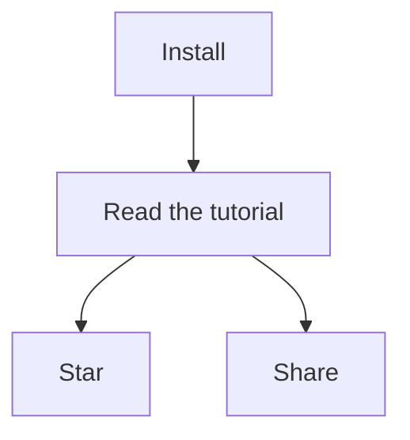

# 05 - Notes

## Syntax

Notes are written in [GitHub-flavored Markdown](https://guides.github.com/features/mastering-markdown), so you can write emojis (`:joy:` -> :joy:), ~~strikethrough~~ text etc. in a familiar fashion.

This also means that your notes aren't locked into any proprietary format.

Notes can have some metadata: if they are favorited or not, which tags they have, which attachments they have, etc. These metadata are written as Markdown front matter. This is taken care of for you.

## Syntax Plugins

Some syntax plugins for providing you [KaTeX](https://katex.org) and [mermaid](https://github.com/knsv/mermaid) support are built-in, check out this note's source.

#### KaTeX

Wrap a formula in `$$` to display it as a block:

$$f{x} = \int_{-\infty}^\infty \hat f\xi\,e^{2 \pi i \xi x} \,d\xi$$

Multi-line block formulas are supported too:

$$
\begin{pmatrix}
   f(\alpha) & b        & c         \\
   e         & f(\beta) & g         \\
   i         & j        & f(\gamma)
\end{pmatrix}
$$

Wrap it in `$` to display it inline: $e^{iπ} + 1 = 0$.

The [mhchem](https://mhchem.github.io/MathJax-mhchem) syntax for writing chemical expressions is supported too:

$$\ce{ SO4^2- + Ba^2+ -> BaSO4 v }$$

#### AsciiMath

Wrap a formula in `&&` to display it as a block:

&&sum_(i=1)^n i^3=((n(n+1))/2)^2&&

Wrap it in `&` to display it inline: &e = mc^2&.

#### mermaid

## Attachments

Notes can have attachments, because sooner or later you'll want to save a file in a note, be it a boarding pass for your next trip or something else.

Attachments can be added via the popup menu in the toolbar. Attachments are simply copied into your data directory, under the `attachments` sub-directory.

You can open/remove them at any time.
